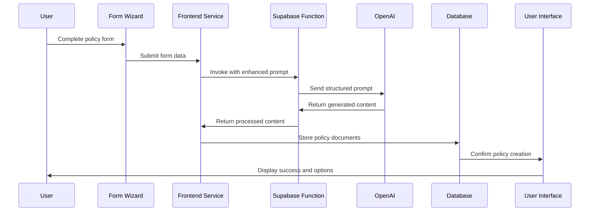

# AI Features

ComplyFlow leverages artificial intelligence through several key integrations to provide advanced compliance management capabilities. This document outlines the AI features, implementation details, and technical architecture.

## AI Capabilities Overview

The platform incorporates AI in several key areas:

1. **Policy Generation**: Comprehensive compliance policy creation
2. **Compliance Guidance**: AI assistant for compliance questions
3. **Risk Assessment**: Automated risk analysis and recommendations
4. **Content Summarization**: Extracting key points from compliance documents
5. **Framework Mapping**: Identifying relationships between different compliance frameworks


## OpenAI Integration

### Implementation Architecture

The platform uses OpenAI's GPT models through a secure integration pattern:

1. **Edge Function Layer**: Supabase Edge Functions provide secure API key handling
2. **Prompt Engineering**: Specialized prompts designed for compliance contexts
3. **Response Processing**: Structured parsing of AI-generated content
4. **Rate Limiting & Monitoring**: Usage tracking and limiting to control costs

### Models Used

- **GPT-4o**: Primary model for comprehensive policy generation
  - Higher token limits (16k+)
  - More detailed and nuanced understanding of compliance
  - Used for generating complete policy documents

- **GPT-4o-mini**: Secondary model for interactive guidance
  - Lower cost and faster response times
  - Sufficient for answering specific compliance questions
  - Used for the OpenAIAssistant component

### Technical Implementation

#### Edge Function for Policy Generation

```typescript
// supabase/functions/generate-comprehensive-policy/index.ts

const comprehensivePrompt = `
You are an expert compliance auditor and policy writer with extensive experience. 
Create a HIGHLY DETAILED and COMPREHENSIVE ${frameworkType || 'compliance'} policy document for 
"${companyName || 'the organization'}", a ${industry || ''} company with ${companySize || ''} employees.

Company Context:
- Company Name: ${companyName || 'The organization'}
- Industry: ${industry || 'Technology'}
- Company Size: ${companySize || 'Medium-sized'}
...
`;

const response = await openai.chat.completions.create({
  model: options?.model || "gpt-4o",
  messages: [
    { 
      role: "system", 
      content: "You are a compliance expert specialized in creating detailed policy documents..." 
    },
    { role: "user", content: comprehensivePrompt }
  ],
  max_tokens: options?.max_tokens || 8000,
  temperature: options?.temperature || 0.7
});
```

#### Frontend Service Integration

```typescript
// src/services/openaiService.ts

export const generateCompliancePolicy = async (
  prompt: string,
  formData: any,
  options: OpenAIRequestOptions = {}
) => {
  const enhancedPrompt = `${prompt}\n\nIMPORTANT: Generate a HIGHLY DETAILED and COMPREHENSIVE policy...`;
  
  const { data, error } = await supabase.functions.invoke('generate-comprehensive-policy', {
    body: {
      prompt: enhancedPrompt,
      formData,
      options: {
        model: options.model || 'gpt-4o',
        temperature: options.temperature || 0.7,
        max_tokens: options.max_tokens || 16000,
        stream: options.stream || false
      }
    }
  });
  
  // Process response...
};
```

#### AI Assistant Component

```tsx
// src/components/compliance/OpenAIAssistant.tsx

const OpenAIAssistant: React.FC<OpenAIAssistantProps> = ({
  onGenerateContent,
  isLoading,
  placeholder,
  promptContext,
  initialPrompt,
  headingText,
  frameworkId,
  aiResponse
}) => {
  // Implementation details...
  
  return (
    <div className="bg-blue-50 p-5 rounded-lg border border-blue-100 mb-6 shadow-sm">
      {/* AI Assistant UI */}
    </div>
  );
};
```

## Prompt Engineering

### Specialized Prompt Templates

The platform uses carefully crafted prompts for different compliance needs:

1. **Policy Generation Prompts**: Structured to include:
   - Company context and profile
   - Framework-specific requirements
   - Industry considerations
   - Required policy sections
   - Content length and detail requirements

2. **Framework Guidance Prompts**: For the AI assistant:
   - Framework-specific context
   - Control implementation guidance
   - Evidence requirements
   - Common implementation challenges

### Example Policy Generation Prompt

```
You are an expert compliance auditor and policy writer with extensive experience. 
Create a HIGHLY DETAILED and COMPREHENSIVE ${frameworkType} policy document for 
"${companyName}", a ${industry} company with ${companySize} employees.

Company Context:
- Company Name: ${companyName}
- Industry: ${industry}
- Company Size: ${companySize}
- Data Types Handled: ${dataTypes}
- Business Location: ${businessLocation}
- Infrastructure Details: ${infrastructureDetails}
- Security Controls: ${securityControls}
- Risk Appetite: ${riskAppetite}

STRICT REQUIREMENTS:
1. The policy document MUST be EXTREMELY COMPREHENSIVE, with AT LEAST 3000 WORDS.
2. Include a proper policy structure with the following sections:
   - Executive Summary (minimum 300 words)
   - Introduction and Purpose (minimum 300 words)
   - Scope and Applicability (minimum 300 words)
   - Detailed Policy Statements (minimum 800 words)
   - Implementation Guidelines (minimum 400 words)
   - Roles and Responsibilities (minimum 400 words)
   - Compliance Monitoring and Auditing (minimum 300 words)
   - Incident Response Procedures (minimum 300 words)
   - Review and Update Process (minimum 200 words)
3. For EACH policy section, provide AT LEAST 4-5 substantive paragraphs with specific and actionable policy statements.
4. Make frequent reference to the company name throughout the document.
5. Provide highly specific implementation measures tailored to the industry.
...
```

### Example AI Assistant Prompt

```
As a ${frameworkName} compliance expert, provide detailed guidance for the following request: ${prompt}. 
Focus on practical implementation, specific controls, and evidence collection requirements for a service organization.
```

## Policy Generation Process

The policy generation process involves several steps:

1. **User Input Collection**:
   - Four-step wizard collects organization details
   - Data infrastructure information
   - Security controls and risk preferences
   - Review and confirmation

2. **AI Processing**:
   - Prompt construction with form data
   - API call via Edge Function
   - Processing and structuring response

3. **Output Generation**:
   - Primary policy document
   - Risk assessment document
   - Implementation guidelines
   - Supporting materials

### Architecture Flow



## AI Assistant Implementation

The AI assistant provides guidance on compliance implementation:

### Key Features

1. **Contextual Guidance**: Framework-specific assistance
2. **Preset Queries**: Common compliance questions
3. **Custom Queries**: User-specific questions
4. **Response Management**: Copy, save, or follow up

### Technical Implementation

```typescript
// src/hooks/useFrameworkAI.tsx

export function useFrameworkAI(frameworkId: string) {
  const [isGenerating, setIsGenerating] = useState(false);
  const [aiResponse, setAiResponse] = useState<string | null>(null);
  
  const generateWithAI = async (prompt: string) => {
    setIsGenerating(true);
    
    try {
      const frameworkName = frameworkId.toUpperCase();
      const enhancedPrompt = `As a ${frameworkName} compliance expert, provide detailed guidance...`;
      
      const response = await completeWithAI(enhancedPrompt, {
        model: 'gpt-4o-mini',
        temperature: 0.7,
        max_tokens: 2000
      });
      
      setAiResponse(response.content);
    } catch (error) {
      console.error('Error generating AI guidance:', error);
    } finally {
      setIsGenerating(false);
    }
  };
  
  return {
    isGenerating,
    aiResponse,
    generateWithAI
  };
}
```

## Risk Assessment Generation

The platform also generates comprehensive risk assessments:

```typescript
// From supabase/functions/generate-comprehensive-policy/index.ts

const riskAssessmentPrompt = `
Create a comprehensive risk assessment document for ${companyName || 'the organization'}, a ${industry || ''} company.

Include the following sections:
1. Executive Summary
2. Critical Assets (with detailed descriptions of at least 5 critical assets)
3. Threats and Vulnerabilities (identify at least 7 specific threats)
4. Risk Mitigation Strategies (provide at least 7 detailed strategies)
5. Implementation Timeline and Responsibilities
6. Monitoring and Review Process
...
`;

const riskResponse = await openai.chat.completions.create({
  model: "gpt-4o",
  messages: [{ role: "system", content: riskAssessmentPrompt }],
  max_tokens: 4000,
  temperature: 0.7
});
```

## Performance and Optimization

### Token Usage Optimization

- Careful prompt engineering to minimize token usage
- Token counting and monitoring
- Breaking large requests into manageable chunks

### Cost Management

- Using GPT-4o-mini for simpler queries
- Caching common responses
- Rate limiting to prevent unexpected usage spikes

### Response Time Improvements

- Optimized prompt design for faster processing
- Progress indicators for long-running generations
- Caching mechanisms for frequently accessed guidance

## Future AI Enhancements

Planned AI feature enhancements include:

1. **Control Mapping**: Automatically mapping controls across frameworks
2. **Gap Analysis**: Identifying compliance gaps and remediation needs
3. **Evidence Validation**: AI review of compliance evidence
4. **Automated Auditing**: AI-assisted pre-audit assessments
5. **Continuous Policy Updates**: Monitoring regulatory changes and suggesting updates

The AI features in ComplyFlow provide a foundation for advanced compliance management, reducing the time and expertise required to implement comprehensive compliance programs.
