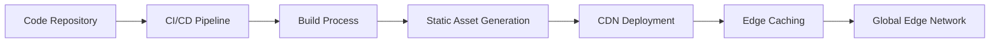
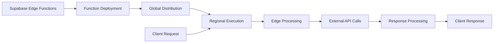

# Deployment Architecture

This document outlines the deployment architecture for the ComplyFlow SAAS platform, detailing how the application is deployed, scaled, and maintained in production.

## Deployment Overview

ComplyFlow is designed as a modern web application with a clear separation of concerns between frontend and backend components:

1. **Frontend Application**: Static assets deployed to edge CDN
2. **Backend Services**: Supabase-hosted services including database, authentication, and edge functions
3. **File Storage**: Object storage for documents and audio files
4. **AI Services**: External API integrations with OpenAI and ElevenLabs

## Frontend Deployment

### Static Asset Hosting

The React application is built as static assets and deployed to a global CDN:

- **Build Process**: Vite builds optimized production assets
- **Hosting Provider**: Vercel or Netlify for global edge distribution
- **Asset Optimization**: 
  - Code splitting for reduced bundle sizes
  - Image optimization and responsive sizing
  - Font subsetting and optimization
  - CSS minification and purging

### Deployment Pipeline

### Performance Optimizations

1. **Edge Caching**: Assets cached at edge locations
2. **Content Delivery Network**: Global distribution for low latency
3. **Route-Based Code Splitting**: Dynamic imports based on routes
4. **Preloading**: Critical assets preloaded for faster rendering
5. **Service Worker**: Optional caching for offline capabilities

## Backend Deployment

### Supabase Architecture

The backend leverages Supabase's managed services:

- **Database**: PostgreSQL database with Row-Level Security
- **Authentication**: User management and JWT handling
- **Edge Functions**: Serverless compute for API integrations
- **Storage**: Object storage for documents and files
- **Realtime**: WebSocket connections for live updates

### Database Configuration

PostgreSQL is configured for optimal performance:

- **Connection Pooling**: Efficient handling of concurrent connections
- **Read Replicas**: For high-read scenarios (optional)
- **Database Resources**: Scaled based on tenant requirements
- **Backup Strategy**: Automated daily backups with point-in-time recovery
- **Monitoring**: Performance monitoring and alerting

### Edge Functions Deployment

### Storage Configuration

Storage buckets are configured for specific use cases:

- **voice-summaries**: Public bucket for voice summary audio files
- **voice-training**: Public bucket for training audio files
- **policy-documents**: Private bucket with RLS for policy documents
- **evidence-files**: Private bucket with RLS for compliance evidence

## External Service Integration

### OpenAI Integration

- **API Access**: Via Supabase Edge Functions
- **Secret Management**: API keys stored as Edge Function secrets
- **Rate Limiting**: Implemented at application level
- **Error Handling**: Graceful degradation for API limits or outages

### ElevenLabs Integration

- **API Access**: Via Supabase Edge Functions
- **Secret Management**: API keys stored as Edge Function secrets
- **Audio Caching**: Generated audio cached to minimize API calls
- **Fallback Mechanisms**: Text display when audio unavailable

## Scaling Strategy

### Frontend Scaling

- **Static Generation**: Scales automatically with CDN
- **Edge Caching**: Distributes load globally
- **Client-Side Rendering**: Reduces server load for dynamic content

### Backend Scaling

- **Database Scaling**:
  - Vertical scaling for increased load
  - Connection pooling for concurrent connections
  - Read replicas for read-heavy workloads

- **Edge Functions**:
  - Automatic scaling to zero when not in use
  - Concurrent execution based on demand
  - Regional deployment for reduced latency

- **Storage Scaling**:
  - Automatic scaling based on storage needs
  - CDN integration for frequently accessed files
  - Object lifecycle policies for cost optimization

## Multi-Tenant Considerations

The deployment architecture supports multi-tenancy through:

1. **Row-Level Security**: Data isolation between organizations
2. **Resource Allocation**: Fair usage across tenants
3. **Monitoring**: Per-tenant usage tracking
4. **Rate Limiting**: Preventing resource monopolization

## Security Architecture

### Network Security

- **HTTPS Everywhere**: All traffic encrypted in transit
- **API Gateway**: Controlled access to backend services
- **IP Restrictions**: Optional IP allowlisting for sensitive operations
- **DDoS Protection**: CDN-level protection against attacks

### Authentication Security

- **JWT-Based Auth**: Secure token-based authentication
- **Refresh Token Rotation**: Enhanced session security
- **MFA Support**: Optional multi-factor authentication
- **Session Management**: Configurable session timeouts

### Data Security

- **Encryption at Rest**: Database and file encryption
- **Encryption in Transit**: HTTPS for all connections
- **Data Classification**: Appropriate controls based on sensitivity
- **Backup Encryption**: Encrypted backup storage

## Monitoring and Observability

### Frontend Monitoring

- **Error Tracking**: Client-side error reporting
- **Performance Monitoring**: Core Web Vitals tracking
- **User Analytics**: Usage patterns and behavior
- **Feature Adoption**: Feature usage tracking

### Backend Monitoring

- **Database Metrics**: Query performance and resource usage
- **Function Metrics**: Execution time and error rates
- **API Usage**: Endpoint usage and response times
- **Storage Metrics**: Usage and access patterns

### Alerting Strategy

- **Performance Thresholds**: Alerts for degraded performance
- **Error Rate Monitoring**: Abnormal error rate detection
- **Resource Utilization**: Capacity planning alerts
- **Security Events**: Potential security incident alerting

## Disaster Recovery

### Backup Strategy

- **Database Backups**: Automated daily backups
- **Point-in-Time Recovery**: Fine-grained recovery options
- **Storage Backups**: Object versioning and backup
- **Configuration Backups**: Infrastructure as code

### Recovery Procedures

- **RTO (Recovery Time Objective)**: Target of <1 hour
- **RPO (Recovery Point Objective)**: Target of <15 minutes
- **Failover Testing**: Regular disaster recovery testing
- **Runbooks**: Documented recovery procedures

## CI/CD Pipeline

### Continuous Integration

- **Automated Testing**: Unit, integration, and E2E tests
- **Code Quality**: Linting, type checking, and code analysis
- **Security Scanning**: Dependency and code vulnerability scanning
- **Build Verification**: Ensuring successful builds

### Continuous Deployment

- **Environment Promotion**: Dev → Staging → Production
- **Canary Releases**: Gradual production rollouts
- **Feature Flags**: Runtime feature enablement
- **Rollback Capability**: Quick reversion to previous versions

## Infrastructure as Code

The deployment infrastructure is managed through code:

- **Terraform/Pulumi**: Cloud resource provisioning
- **GitHub Actions**: CI/CD pipeline automation
- **Environment Configuration**: Environment-specific settings
- **Secret Management**: Secure handling of credentials

## Compliance Considerations

The deployment architecture supports compliance requirements:

- **Data Residency**: Region-specific deployment options
- **Audit Logging**: Comprehensive activity logging
- **Access Controls**: Granular permissions and approvals
- **Compliance Reporting**: Evidence generation for audits

This comprehensive deployment architecture ensures that the ComplyFlow platform is scalable, secure, and resilient while providing optimal performance for users globally.
