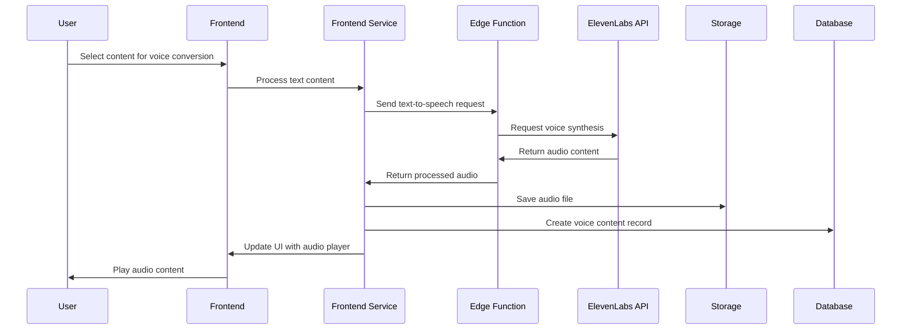

# Voice Processing

ComplyFlow incorporates advanced voice processing capabilities to enhance accessibility and provide innovative compliance training options. This document outlines the voice features, implementation details, and technical architecture.

## Voice Features Overview

The platform incorporates voice processing in several areas:

1. **Policy Summaries**: Converting compliance policies to voice
2. **Training Materials**: Creating spoken compliance training content
3. **Accessibility Features**: Making compliance content more accessible


## ElevenLabs Integration

### Implementation Architecture

Voice processing is implemented through integration with ElevenLabs:

1. **Edge Function Layer**: Supabase Edge Functions provide secure API key handling
2. **Text Processing**: Preparing and formatting text for voice synthesis
3. **Audio Processing**: Converting and storing audio for playback
4. **User Preferences**: Personalized voice settings for each user

### Voice Models Used

The platform uses ElevenLabs' voice models:

- **Eleven Multilingual v2**: High-quality voice synthesis for formal documents
- **Eleven Turbo v2**: Faster processing for shorter content

### Technical Implementation

#### Edge Function for Text-to-Speech

```typescript
// supabase/functions/text-to-speech/index.ts

const response = await fetch(`https://api.elevenlabs.io/v1/text-to-speech/${voiceId}`, {
  method: 'POST',
  headers: {
    'Accept': 'audio/mpeg',
    'Content-Type': 'application/json',
    'xi-api-key': ELEVENLABS_API_KEY,
  },
  body: JSON.stringify({
    text: text,
    model_id: ttsModel,
    voice_settings: {
      stability: 0.5,
      similarity_boost: 0.75,
    }
  }),
});

// Process audio response
const audioBuffer = await response.arrayBuffer();
const base64Audio = btoa(String.fromCharCode(...new Uint8Array(audioBuffer)));

return new Response(
  JSON.stringify({
    success: true,
    audioContent: base64Audio,
    format: 'mp3'
  })
);
```

#### Frontend Service Integration

```typescript
// src/services/voice/speech-synthesis.service.ts

export interface SpeechGenerationResult {
  success: boolean;
  audioUrl?: string;
  audioBlob?: Blob;
  audioBase64?: string;
  duration?: number;
  error?: string;
}

const speechSynthesisService = {
  async generateSpeech(
    text: string, 
    voiceId: string, 
    model?: string, 
    language?: string
  ): Promise<SpeechGenerationResult> {
    try {
      // Implementation details...
      
      const response = await fetch('/api/text-to-speech', {
        method: 'POST',
        headers: {
          'Content-Type': 'application/json',
        },
        body: JSON.stringify({
          text,
          voiceId,
          model,
          language
        }),
      });
      
      // Process response...
      
      return {
        success: true,
        audioUrl,
        audioBlob,
        audioBase64: data.audioContent,
        duration: estimatedDuration,
      };
    } catch (error) {
      return {
        success: false,
        error: error.message || 'Failed to generate speech',
      };
    }
  }
};
```

## Voice Summary Creation

### Feature Description

Voice summaries allow users to:
1. Convert compliance policies to audio
2. Listen to key compliance requirements
3. Access compliance content on mobile devices

### Implementation

#### Voice Summary Creation Component

```tsx
// src/components/voice/GenerateVoiceSummary.tsx

const GenerateVoiceSummary: React.FC<GenerateVoiceSummaryProps> = ({ onGenerated }) => {
  // State and handler implementation...
  
  const handleGenerateSummary = async () => {
    // 1. Generate or use existing summary text
    // 2. Convert text to speech using ElevenLabs
    // 3. Save audio file to storage
    // 4. Create voice summary record in database
    // 5. Call onGenerated callback
  };
  
  return (
    <form onSubmit={handleSubmit} className="space-y-4">
      {/* Form fields for generating voice summary */}
    </form>
  );
};
```

#### Voice Summary List Component

```tsx
// src/components/voice/VoiceSummaryList.tsx

const VoiceSummaryList: React.FC = () => {
  // State and data fetching implementation...
  
  return (
    <div className="space-y-4">
      {isLoading ? (
        <LoadingState />
      ) : summaries.length === 0 ? (
        <EmptyState />
      ) : (
        <div className="grid grid-cols-1 md:grid-cols-2 lg:grid-cols-3 gap-4">
          {summaries.map(summary => (
            <VoiceSummaryCard key={summary.id} summary={summary} />
          ))}
        </div>
      )}
    </div>
  );
};
```

## Voice Training Materials

### Feature Description

Voice training allows creation of:
1. Spoken compliance training modules
2. Auditory learning resources
3. Accessibility options for training materials

### Implementation

#### Training Session Creation Component

```tsx
// src/components/voice/CreateTrainingSession.tsx

const CreateTrainingSession: React.FC<CreateTrainingSessionProps> = ({ onCreated }) => {
  // State and handler implementation...
  
  const handleCreateSession = async () => {
    // 1. Process training content
    // 2. Convert text to speech using ElevenLabs
    // 3. Save audio file to storage
    // 4. Create training session record in database
    // 5. Call onCreated callback
  };
  
  return (
    <form onSubmit={handleSubmit} className="space-y-4">
      {/* Form fields for creating training session */}
    </form>
  );
};
```

## User Voice Preferences

### Feature Description

Voice preferences allow users to:
1. Select preferred voice for generated content
2. Configure playback speed
3. Set auto-play preferences
4. Choose language options

### Implementation

#### Voice Settings Component

```tsx
// src/components/voice/VoiceSettings.tsx

const VoiceSettings: React.FC<VoiceSettingsProps> = ({ onSettingsChange }) => {
  // State and data fetching implementation...
  
  const handleSaveSettings = async () => {
    // Save user voice preferences to database
    // Call onSettingsChange callback
  };
  
  return (
    <div className="space-y-6">
      <VoiceSelector 
        selectedVoiceId={preferences.preferredVoiceId} 
        onVoiceChange={handleVoiceChange} 
      />
      
      <PlaybackSpeedSelector 
        speed={preferences.playbackSpeed} 
        onSpeedChange={handleSpeedChange} 
      />
      
      <AutoPlayToggle 
        enabled={preferences.autoPlay} 
        onToggle={handleAutoPlayToggle} 
      />
      
      <Button onClick={handleSaveSettings}>
        Save Preferences
      </Button>
    </div>
  );
};
```

#### Voice Preferences Service

```typescript
// src/services/voice/voice-preferences.service.ts

const voicePreferencesService = {
  async getUserVoicePreference(userId?: string): Promise<UserVoicePreference> {
    // Get user preferences from database or return defaults
  },
  
  async saveUserVoicePreference(
    preferences: Partial<UserVoicePreference>,
    userId?: string
  ): Promise<UserVoicePreference> {
    // Save preferences to database
  },

  getVoiceById(voiceId: string): VoiceOption | undefined {
    // Return voice details for specified ID
  },
  
  getVoiceNameById(voiceId: string): string {
    // Return voice name for specified ID
  }
};
```

## Audio Player Component

The platform includes a custom audio player for voice content:

```tsx
// src/components/voice/AudioPlayer.tsx

const AudioPlayer: React.FC<AudioPlayerProps> = ({ 
  audioUrl, 
  title,
  voiceId,
  onPlayStatusChange,
  autoPlay = false,
  playbackSpeed = 1.0
}) => {
  // State and audio control implementation...
  
  return (
    <div className="bg-white rounded-lg border border-gray-200 p-4">
      <div className="flex items-center space-x-4">
        <PlayButton playing={isPlaying} onClick={togglePlayPause} />
        <div className="flex-1">
          <ProgressBar currentTime={currentTime} duration={duration} onSeek={handleSeek} />
          <TimeDisplay currentTime={currentTime} duration={duration} />
        </div>
        <SpeedControl speed={playbackSpeed} onSpeedChange={handleSpeedChange} />
        <VolumeControl volume={volume} onVolumeChange={handleVolumeChange} />
      </div>
    </div>
  );
};
```

## Voice Processing Flow

The complete voice processing flow involves several steps:

1. **Content Selection**: User selects policy or creates training content
2. **Text Processing**: Content is processed for optimal voice conversion
3. **Voice Selection**: User's preferred voice is applied
4. **API Request**: Text sent to ElevenLabs via Edge Function
5. **Audio Processing**: Resulting audio is processed and stored
6. **Database Record**: Voice summary or training record created
7. **Audio Playback**: User accesses content through audio player

### Architecture Flow



## Storage and Delivery

Voice content is stored and delivered through several mechanisms:

1. **Storage Buckets**: Audio files stored in Supabase Storage
   - `voice-summaries` bucket for policy summaries
   - `voice-training` bucket for training content

2. **Content Delivery**: Audio served through Supabase CDN
   - Public URLs for efficient global delivery
   - Access controls based on organization membership

3. **Caching Strategy**: Browser caching for frequently accessed content
   - Cache headers for optimal performance
   - Version control to invalidate cache when needed

## Performance Optimization

Several optimizations are implemented for voice processing:

1. **Content Chunking**: Large documents split into manageable chunks
2. **Audio Compression**: MP3 format with balanced quality settings
3. **Parallel Processing**: Multiple chunks processed simultaneously
4. **Progressive Playback**: Audio begins playing before fully downloaded
5. **Background Processing**: Voice generation runs in background

## Accessibility Considerations

Voice features enhance accessibility through:

1. **Screen Reader Compatibility**: Player works with screen readers
2. **Keyboard Navigation**: Full keyboard control for player
3. **ARIA Labels**: Proper labeling for assistive technologies
4. **Visual Indicators**: Synchronized with audio playback
5. **Transcript Option**: Text available alongside audio

The voice processing capabilities in ComplyFlow provide innovative ways to consume compliance content, enhancing accessibility and enabling new learning modalities for compliance training.
