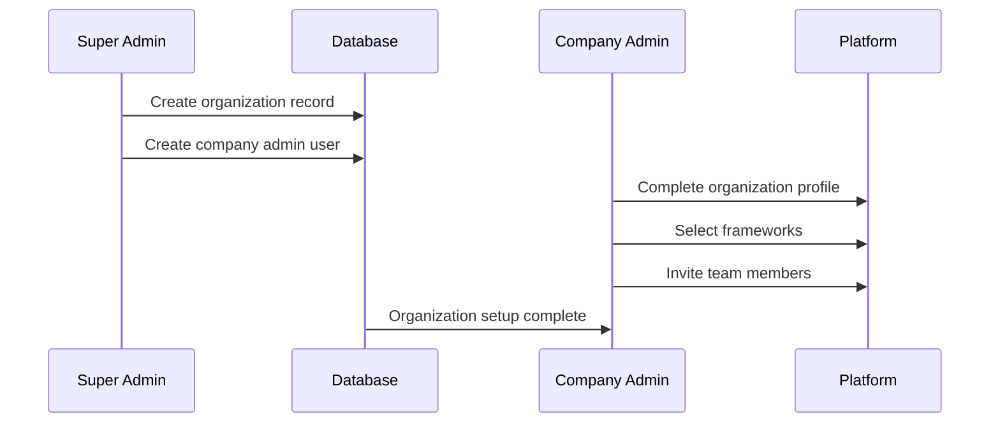
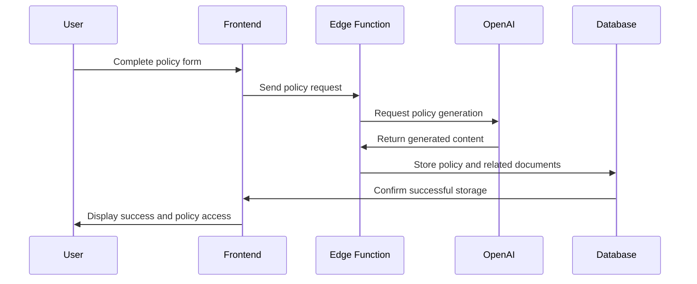
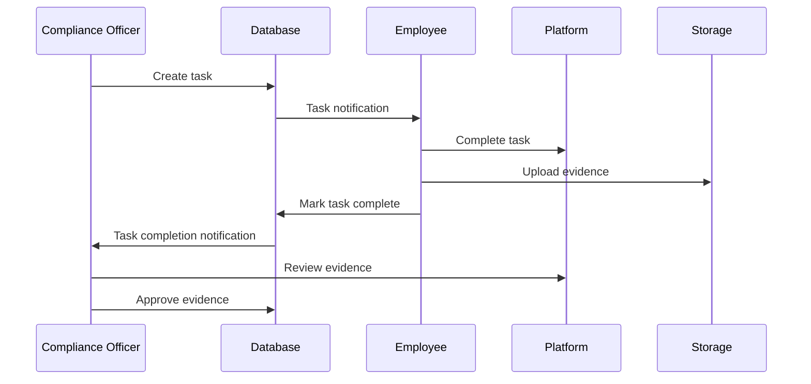
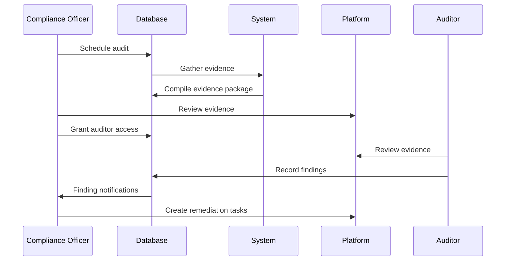
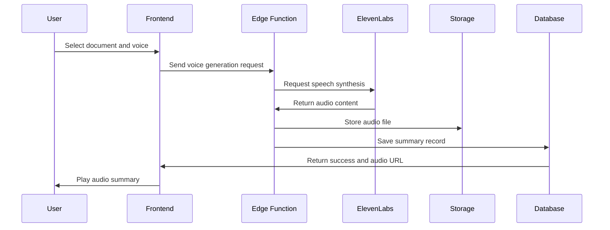
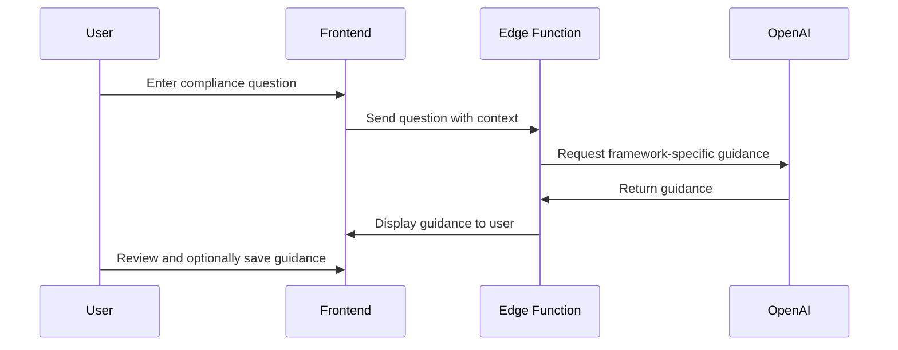
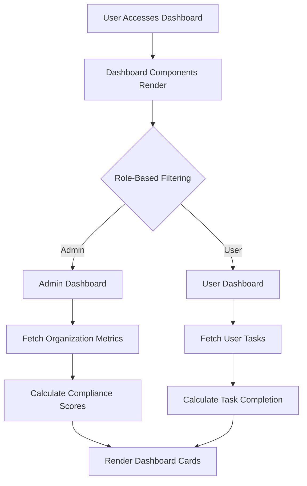
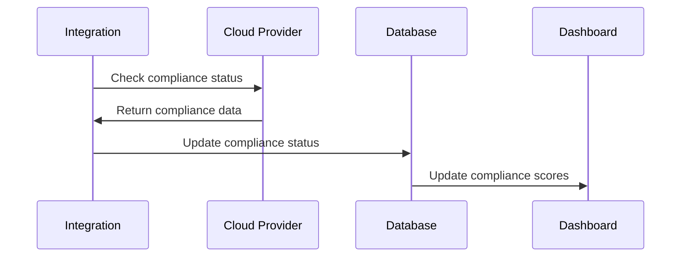
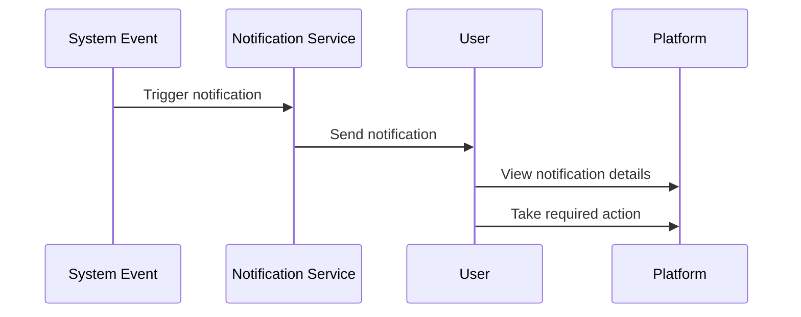

# User Workflows

This document outlines the key user workflows within the ComplyFlow platform, describing how users interact with the system to accomplish compliance-related tasks.

## Role-Based Workflows

The platform supports different workflows based on user roles:

1. **Super Admin**: Platform administration and organization management
2. **Company Admin**: Organization-level compliance management
3. **Compliance Officer**: Implementation and monitoring of compliance
4. **Employee**: Task completion and evidence submission
5. **Auditor**: Compliance assessment and review

## Organization Onboarding

### Workflow Steps

1. **Super Admin creates organization**
   - Enters organization details
   - Sets subscription tier
   - Creates initial Company Admin user

2. **Company Admin completes setup**
   - Updates organization profile
   - Invites team members
   - Selects applicable compliance frameworks
   - Configures organization-specific settings

3. **Profile Completion**
   - Organization details (size, industry, etc.)
   - Data infrastructure information
   - Security controls inventory
   - Risk appetite assessment

### Implementation Details

## Compliance Framework Implementation

### Workflow Steps

1. **Framework Selection**
   - Company Admin or Compliance Officer selects frameworks
   - Platform creates initial framework structure

2. **Policy Generation**
   - Complete policy generation form
   - AI generates comprehensive policies
   - Review and customize generated content
   - Approve and publish policies

3. **Control Implementation**
   - Assign controls to team members
   - Set implementation deadlines
   - Track implementation progress
   - Document evidence of compliance

4. **Continuous Monitoring**
   - Regular progress assessments
   - Gap analysis and remediation
   - Policy updates and version control

### Implementation Details

The policy generation workflow leverages OpenAI for creating comprehensive compliance documentation:

## Task Management

### Workflow Steps

1. **Task Creation**
   - Compliance Officer creates tasks
   - Tasks linked to specific controls/requirements
   - Assignment to specific team members
   - Setting due dates and priorities

2. **Task Execution**
   - Employee receives notification
   - Employee completes assigned task
   - Employee uploads evidence
   - Employee marks task as complete

3. **Task Review**
   - Compliance Officer reviews completed tasks
   - Approves or requests additional evidence
   - Links evidence to compliance requirements

### Implementation Details

## Audit Preparation and Execution

### Workflow Steps

1. **Audit Scheduling**
   - Create audit record in the system
   - Set audit dates and objectives
   - Assign auditor access

2. **Evidence Collection**
   - System gathers required evidence
   - Compliance Officer reviews evidence
   - Additional evidence collection as needed

3. **Audit Execution**
   - Auditor reviews evidence
   - Records findings in the system
   - Identifies gaps and recommendations

4. **Remediation**
   - Tasks created for remediation
   - Tracking of remediation progress
   - Verification of completed remediation

### Implementation Details

## Voice Summary Creation and Consumption

### Workflow Steps

1. **Summary Creation**
   - Select compliance document
   - Create summary or extract key points
   - Choose voice preferences
   - Generate voice summary

2. **Summary Access**
   - Browse available summaries
   - Play audio with playback controls
   - Download for offline listening

### Implementation Details

The voice summary generation workflow leverages ElevenLabs for text-to-speech conversion:

## AI Assistance Workflow

### Workflow Steps

1. **Question Entry**
   - User types compliance-related question
   - Optional selection of framework context

2. **AI Processing**
   - Request sent to OpenAI with context
   - Response generated with specific guidance

3. **Response Review**
   - User reviews AI guidance
   - Option to copy, save, or ask follow-up questions

### Implementation Details

## Dashboard and Reporting

### Workflow Steps

1. **Dashboard Review**
   - View compliance scores
   - Track implementation progress
   - Monitor upcoming deadlines
   - Identify risk areas

2. **Report Generation**
   - Select report parameters
   - Generate compliance reports
   - Export in various formats (PDF, Excel)
   - Share with stakeholders

### Implementation Details

The dashboard components pull data from various tables and calculate metrics in real-time:

## Integration Workflows

### Cloud Provider Monitoring

### Notification Workflows

These workflows represent the core user interactions within the ComplyFlow platform, supporting comprehensive compliance management from framework selection through auditing and continuous improvement.
